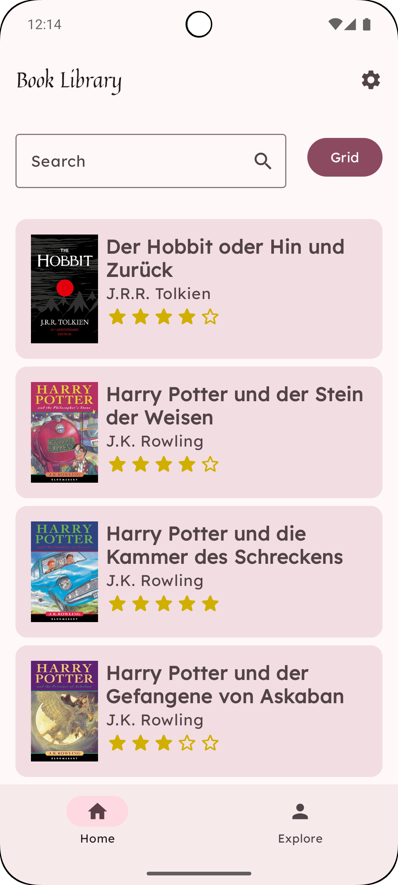
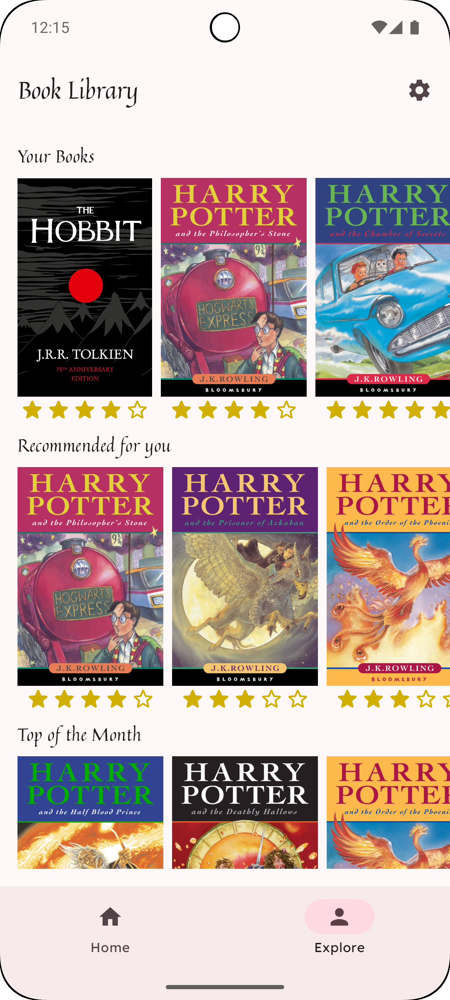

# 🌙 Sona  
**Breathe & Balance**

**Sona** ist eine moderne Meditations-App für Android, die Nutzer*innen zu mehr Achtsamkeit, Ruhe und innerer Balance begleitet.  
In einer hektischen Welt schafft Sona einen digitalen Rückzugsort – mit beruhigender Musik, liebevoll gestaltetem Design und täglichen Impulsen für Körper und Geist.

---

## Für wen ist sie geeignet?

Sona richtet sich an alle, die bewusste Pausen suchen – ob im stressigen Schulalltag, in Lernphasen, während mentaler Tiefs oder einfach als tägliches Ritual.  
Sie ist intuitiv nutzbar, funktioniert auch offline und ist komplett werbefrei.

---

## Welches Problem löst sie?

Viele Meditations-Apps sind überladen, auf Abo-Modelle ausgerichtet oder setzen ständige Internetverbindung voraus.  
**Sona** verzichtet bewusst auf all das: Kein Abo, keine Werbung, keine Überforderung. Nur du, deine Atmung – und ein ruhiger, klar strukturierter Ort.

---

## Was macht Sona anders?

-  Hochwertige, freie Meditationsmusik lokal integriert (Chosic.com)
-  Optionale tägliche Zitate aus einer API (Typefit API)
-  Ästhetisches Design in beruhigenden Farben (Vintage White, Noble Red, Elegant Black)
-  Minimalistisch, leichtgewichtig, 100 Compose-basiert

## Design
Füge hier am Ende die Screenshots deiner App ein.

  
  
  

##  Features

**Tipp:** Diese Liste wird regelmäßig erweitert und gepflegt.

- [x] Splashscreen mit animiertem Logo  
- [x] Homescreen mit täglichen Empfehlungen  
- [x] Navigationsstruktur mit BottomNavigation  
- [x] Kategorien: Sleep, Focus, Breathe, Morning  
- [x] Lokale Audio- und Bildintegration  
- [x] Zitat des Tages über Typefit API  
- [ ] Favoritenfunktion mit DataStore oder Room  
- [ ] Erinnerungsfunktion (optional)  
- [ ] Offline-Download ganzer Playlists (optional)  
- [ ] Profilverwaltung (optional)

## ⚙️ Technischer Aufbau

### Projektaufbau

Die App folgt dem MVVM-Ansatz in einer modularen Compose-Architektur.

### Datenspeicherung

Aktuell speichert Sona:
- Audiodateien (lokal im `res/raw/`)
- Bilder (lokal im `res/drawable/`)
- Struktur-JSON (`assets/meditations.json`)
- Später: Favoriten via Room oder DataStore

📌 *Warum lokal?*  
Die App ist auf **Offline-Nutzung optimiert** (kein Zwang zur Cloud), funktioniert stabil ohne Internet, ideal für Schüler*innen oder Fokuszeiten.

---

###  API Calls

- **type.fit** → liefert inspirierende Tageszitate  
  url("https://type.fit/api/quotes"
---

### 3rd-Party Frameworks

Folgende Libraries werden eingesetzt:
- **Jetpack Compose** (UI)
- **Koin** (Dependency Injection)
- **Retrofit + Moshi** (API)
- **Room / DataStore** (optional für Speicherung)
- **Coil** (optional für Bild-Handling)
- **Accompanist** (Navigation-Animations, System UI)

---

##  Ausblick

- [ ] Favoriten-Logik und lokale Speicherung
- [ ] Erinnerungsfunktion per Notification
- [ ] Vollständiger Dark Mode mit Dynamik
- [ ] Upload eigener Meditationen (nur lokal)
- [ ] Erweiterung um Atemübungen mit Animation
- [ ] Lokalisierung (Mehrsprachigkeit)
- [ ] Veröffentlichung im Play Store

🧘 *Sona ist mehr als eine App – es ist eine kleine digitale Pause vom Lärm der Welt.*
