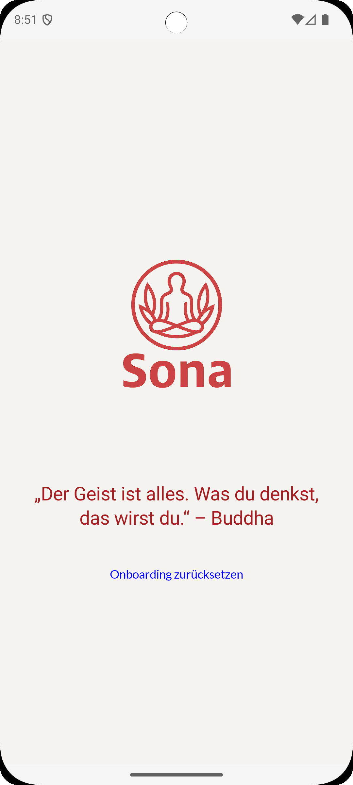
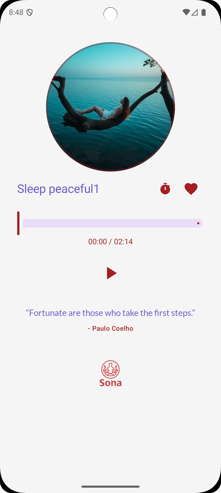
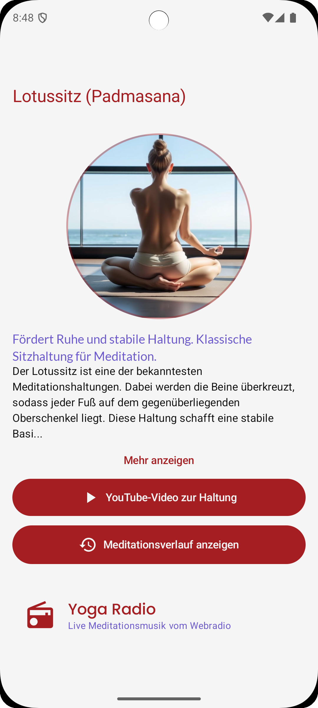
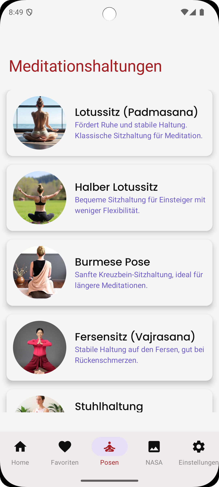
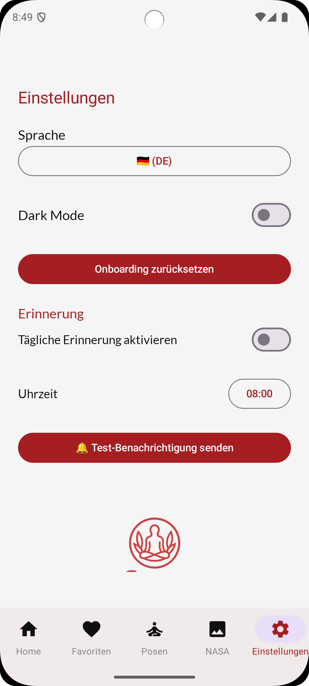
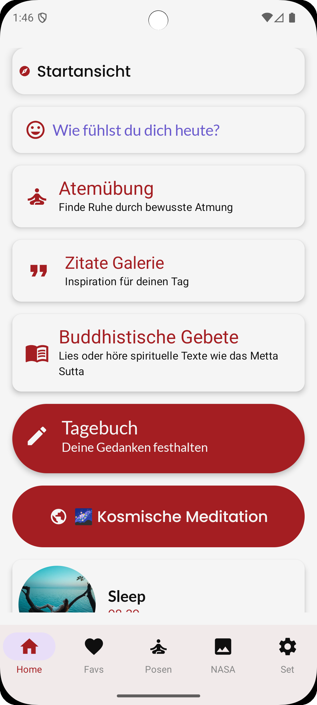

# 🌙 Sona  
**Breathe & Balance**

**Sona** ist eine moderne Meditations-App für Android, die Nutzer*innen zu mehr Achtsamkeit, Ruhe und innerer Balance begleitet.  
In einer hektischen Welt schafft Sona einen digitalen Rückzugsort – mit beruhigender Musik, liebevoll gestaltetem Design und täglichen Impulsen für Körper und Geist.

---

## Für wen ist sie geeignet?

Sona richtet sich an alle, die bewusste Pausen suchen – ob im stressigen Schulalltag, in Lernphasen, während mentaler Tiefs oder einfach als tägliches Ritual.  
Sie ist intuitiv nutzbar, funktioniert auch offline und ist komplett werbefrei.

---

## Welches Problem löst sie?

Viele Meditations-Apps sind überladen, auf Abo-Modelle ausgerichtet oder setzen ständige Internetverbindung voraus.  
**Sona** verzichtet bewusst auf all das: Kein Abo, keine Werbung, keine Überforderung. Nur du, deine Atmung – und ein ruhiger, klar strukturierter Ort.

---

## Was macht Sona anders?

-  Hochwertige, freie Meditationsmusik lokal integriert (Chosic.com)
-  Optionale tägliche Zitate aus einer API (Typefit API)
-  Ästhetisches Design in beruhigenden Farben (Vintage White, Noble Red, Elegant Black)
-  Minimalistisch, leichtgewichtig, 100 Compose-basiert.

## Design
Füge hier am Ende die Screenshots deiner App ein.

  
  
  
   
  
  
   
   
   
 

##  Features

 **Meditationen**
- Offline- und Online-Wiedergabe von Meditationsmusik (lokale MP3s & Pixabay Audio API)
- Fortschrittsanzeige, Dauer & Scrubbing
- Favoritenverwaltung mit Room (persistente Speicherung)
- Kosmische Meditationen mit NASA-Bild des Tages (APOD API)

**Zitate**
- Zufällige Zitate (RealInspire API) im Player
- Zitate-Galerie (type.fit API) mit Autor-Detailansicht
- Favoritenfunktion & Teilen von Zitaten
- Zitate rotieren automatisch (per Timer oder Swipe)

**Onboarding & Kategorien**
- Mehrseitiges visuelles Onboarding mit Swipes
- Kategorienstartseite mit Icons für Meditationen, Musik, Gebete, Journal, etc.

**Journal**
- Tagebuch mit Datum & Zeit
- Kalender mit Markierung von Einträgen
- Anzeige, Bearbeitung und Speicherung von Einträgen

**Geführte Meditationen & Gebete**
- Strukturierter Screen für gesprochene Meditationen
- Buddhistisches Gebetsmodul (SuttaCentral API)
- Texte mit Text-to-Speech, mehrsprachig (DE, EN, FR, ES)

**Kosmische Funktionen**
- NASA Picture of the Day (APOD)
- Integration von Meditation + Bild + Textimpuls

**Atemübungen**
- Atembildschirm mit Sound, Schattenanimation & individueller Dauer
- Integriert in den Meditationsbereich

 **Benachrichtigungen**
- Erinnerung an tägliche Meditation (mit Uhrzeit wählbar)
- NotificationHelper & DataStore-Einstellungen

**Lokalisierung & UI**
- Live-Sprachwechsel (DE, EN, FR, ES) ohne Neustart
- Kompletter Dark Mode Support
- Alle Inhalte mehrsprachig gepflegt
- Kompatibel ab Android API 21+

## ⚙️ Technischer Aufbau
- Kotlin
- Android Jetpack (Compose, ViewModel, Navigation)
- Room, DataStore, Retrofit, Moshi
- Koin Dependency Injection
- Paging3 für Musikdaten
- Coil für Bild-Loading
- Text-to-Speech Integration

### Projektaufbau

Die App folgt dem MVVM-Ansatz in einer modularen Compose-Architektur.

### Datenspeicherung

Aktuell speichert Sona:
- Audiodateien (lokal im `res/raw/`)
- Bilder (lokal im `res/drawable/`)
- Struktur-JSON (`assets/meditations.json`)
- Später: Favoriten via Room oder DataStore

📌 *Warum lokal?*  
Die App ist auf **Offline-Nutzung optimiert** (kein Zwang zur Cloud), funktioniert stabil ohne Internet, ideal für Schüler*innen oder Fokuszeiten.

---

###  API Calls

| Meditationsmusik | [Chosic](chosic.com) |
| Zitate (AudioPlayer) | [RealInspire API](https://api.realinspire.live) |
| Zitate (Galerie) | [type.fit](https://type.fit/api/quotes) |
| NASA-Bilder | [NASA APOD API](https://api.nasa.gov/) |
| Buddhistische Texte | [SuttaCentral API](https://suttacentral.net/api) |

##  Ausblick
- online Meditationsmusik | [Pixabay Audio API](https://pixabay.com/api/docs/audio/)
- [ ] Upload eigener Meditationen (nur lokal)
- [ ] Veröffentlichung im Play Store

🧘 *Sona ist mehr als eine App – es ist eine kleine digitale Pause vom Lärm der Welt.*
